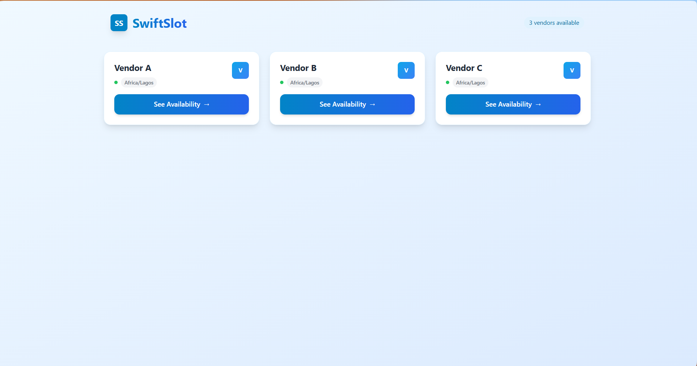

# SwiftSlot

SwiftSlot is a full-stack booking system designed for seamless appointment scheduling with multiple vendors. It features robust backend APIs built with Node.js, Express, Sequelize (MySQL), and a React + Vite + Tailwind frontend. It handles timezone conversions, idempotency for bookings, and prevents double-bookings with transactional safety.

## Table of Contents

- [Project Overview](#project-overview)
- [Tech Stack](#tech-stack)
- [Folder Structure](#folder-structure)
- [Setup & Installation](#setup--installation)
- [Backend API Endpoints](#backend-api-endpoints)
- [Frontend Features](#frontend-features)
- [Timezone Handling](#timezone-handling)
- [Idempotency & Validation](#idempotency--validation)
- [Database Models](#database-models)

## Project Overview

SwiftSlot enables buyers to view vendor availability, book 30-minute slots, and simulate payments. It stores all times in UTC, shows all times on the frontend in Africa/Lagos timezone, and ensures robust concurrency safety via unique booking slots and idempotency keys.

## Tech Stack

### Backend

- Node.js 20+
- Express
- TypeScript
- Sequelize ORM with MySQL
- Vitest + Supertest for testing

### Frontend

- React + Vite
- TypeScript
- Tailwind CSS
- React Router
- Zustand for state management
- date-fns and date-fns-tz for date/time handling

## Folder Structure

swiftslot/
├── api/                  # Backend
│   ├── src/
│   │   ├── config/       # DB, env, timezone config
│   │   ├── controllers/  # API route handlers
│   │   ├── models/       # Sequelize models
│   │   ├── routes/       # Express routes
│   │   ├── services/     # Business logic
│   │   ├── middlewares/  # Middleware (idempotency, error handling)
│   │   ├── utils/        # Helper functions
│   │   ├── db/           # Migrations & seeders
│   │   └── index.ts      # Entry point
│   ├── tests/            # Unit & integration tests
│   └── package.json
│
├── web/                  # Frontend
│   ├── src/
│   │   ├── components/   # Reusable UI components
│   │   ├── pages/        # React pages & routes
│   │   ├── store/        # Zustand state stores
│   │   ├── utils/        # Date/time formatting utils
│   │   ├── api/          # API hooks
│   │   ├── App.tsx
│   │   └── main.tsx
│   ├── index.html
│   └── package.json
│
└── README.md

## Setup & Installation

### Prerequisites

- Node.js 20+
- MySQL server
- npm or yarn

### Backend Setup

1. Navigate to backend folder:

   cd api

2. Install dependencies:

   npm install

3. Create `.env` file with your DB credentials:

   DB_HOST=localhost
   DB_USER=root
   DB_PASS=yourpassword
   DB_NAME=swiftslot
   PORT=3000

4. Run database migrations and seed vendors:

   npx sequelize-cli db:migrate
   npx sequelize-cli db:seed:all

5. Start the backend server:

   npm run dev

### Frontend Setup

1. Navigate to frontend folder:

   cd web
   
2. Navigate to frontend folder:

   cd swiftslot

3. Install dependencies:

   npm install

4. Install Tailwind Version 3:

   npm install -D tailwindcss@3 postcss autoprefixer

5. Start the frontend:

   npm run dev

6. Open your browser at `http://localhost:5173` (default Vite port).

## Backend API Endpoints

| Method | Endpoint                              | Description                                |
| ------ | ------------------------------------- | ------------------------------------------ |
| GET    | `/api/vendors`                        | List all vendors                           |
| GET    | `/api/vendors/:id/availability?date=` | Get vendor availability (Lagos-local date) |
| POST   | `/api/bookings`                       | Create booking (idempotent)                |
| GET    | `/api/bookings`                       | List all bookings                          |
| GET    | `/api/bookings/:id`                   | Get booking details                        |
| POST   | `/api/payments/initialize`            | Mock payment initialization                |
| POST   | `/api/payments/webhook`               | Simulate payment success webhook           |

## Frontend Features

- Vendors Page: Displays a grid of vendors with "See Availability" button.
- Vendor Detail Page: Date picker + available 30-minute slots (9am-5pm Lagos time).
- Checkout Page: Shows selected slot in Lagos & UTC, mock price, booking, and payment flow.
- Bookings Page: Lists all bookings with status and vendor info.
- Timezone conversions done using `date-fns-tz`.

## Timezone Handling

- All dates stored in UTC in the database.
- API input and output use ISO 8601 UTC format.
- Frontend converts UTC to `Africa/Lagos` timezone for display.
- Uses `date-fns-tz` for reliable timezone conversions.

## Idempotency & Validation

- Idempotency key header supported on `POST /api/bookings` to avoid duplicate bookings.
- Prevents booking slots less than 2 hours from now.
- Booking slots are unique per vendor & start time. Attempts to double-book return `409 Conflict`.
- Uses Sequelize transactions to maintain data integrity during booking creation.

## Database Models

- Vendor: `id`, `name`, `timezone`
- Booking: `id`, `vendor_id`, `buyer_id`, `start_time_utc`, `end_time_utc`, `status`, `created_at`
- BookingSlot: `id`, `booking_id`, `vendor_id`, `slot_start_utc` (unique per vendor)
- Payment: `id`, `booking_id`, `ref` (unique), `status`, `raw_event_json`
- IdempotencyKey: `key`, `scope`, `response_hash`, `created_at`

## Home:

## Slot selection:

## Checkout Comfirmation:

## Checkout Payment:

## Booking Details:

## Bookings:

## License

MIT License © 2025 MaffTech

